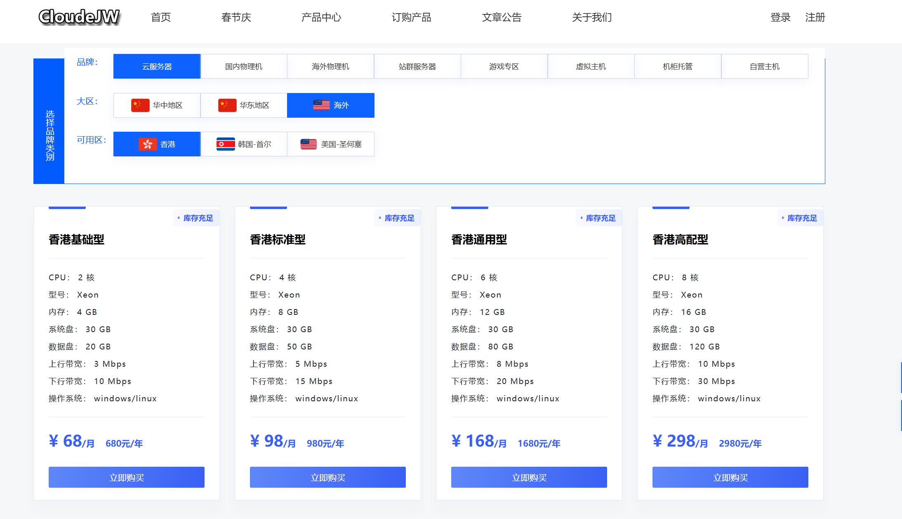
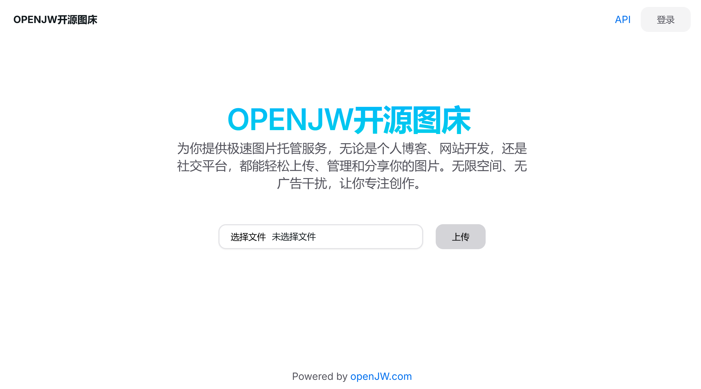

# OPENJW开源图床
## 本项目为开源，任何人都可进行快速部署
 开发环境api:net 6.0、前端react+next.js 数据库 mysql5.6+  
### UBUNTU宝塔部署流程、WINDOWS直接IIS中部署  
服务器自己有直接可以拿来用，没有的话推荐[CloudeJW](https://idc.openjw.com)购买  
国内服务器如果用80 443端口需要备案，直接买香港的即可，4H4G,免备案省事，这家比一线便宜，可开发票  
    

在线DEMO体验：[OPWNJW图床](http://tc.openjw.com)、[1493图床](https://1499.yundua.cn/)  
    
  
1.数据库自行部署mysql5.6+任意版本，我用的是5.7  
宝塔版本检查更新到9.2+，软件商城依次下载mysql5.7、php7.14、phpMyAdmin  
新建数据库名字随便起，例如tuchuang、账号tuchuang、密码、设置好后保存，下一步要用  

2.编译API,VS打开项目 生成后部署；如果用现成的，直接把 图床/bin/Debug/net6.0文件夹复制部署     
appsettings.json中配置api的域名(需要提前购买解析好)，数据库的相关链接信息  
在宝塔中新建.net项目，先配置环境为net6任意版本，添加项目中设置项目路径  
命令中输入 dotnet 图床.dll  
添加好项目后启用、然后配置一下域名、端口、SSL证书  
测试是否部署成功  直接访问 域名/swagger  

3.前端编译部署  
图床/imgbed-frontend为前端项目 react+nextjs开发，先下载node.js安装  
命令行 执行npm install 会自动安装依赖包  
项目根目录下.env 文件中配置API域名和你的网站名称,注意域名后以/结束，否则会请求时404
执行命令 npm run build编译前端静态文件  
编译后会出现在out目录中   
宝塔网站中添加PHP项目，php版本选择纯静态，配置域名（先进行解析）    
进入项目文件夹，把编译后out目录中文件替换上去

部署成功后访问前端域名可测试各项功能

部署中各项问题联系解决
技术支持QQ:3968589563
邮箱：service@openjw.com
Telegram：@OPENJW
